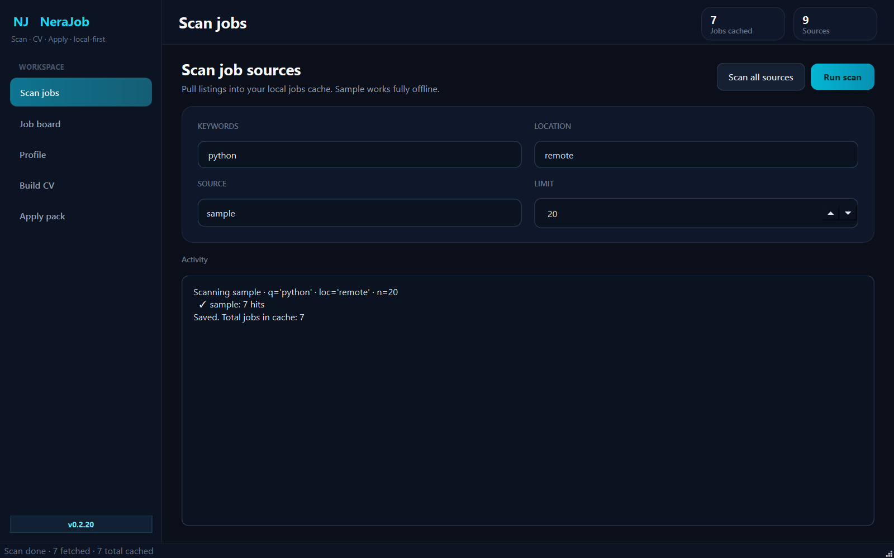
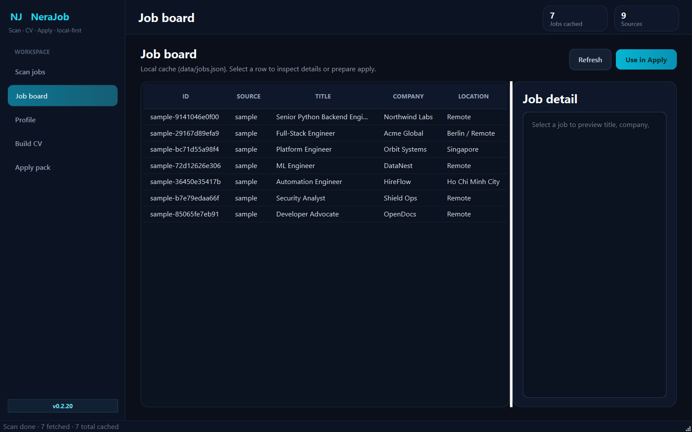
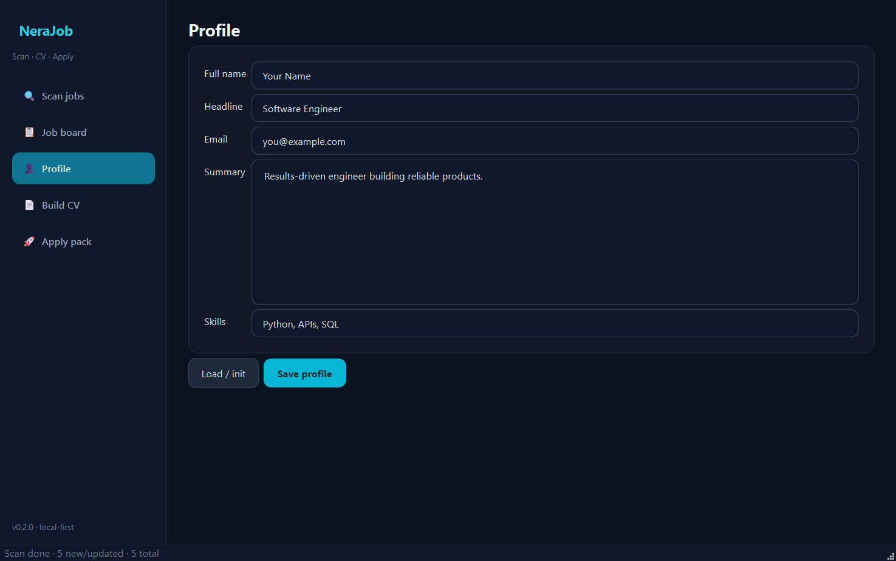
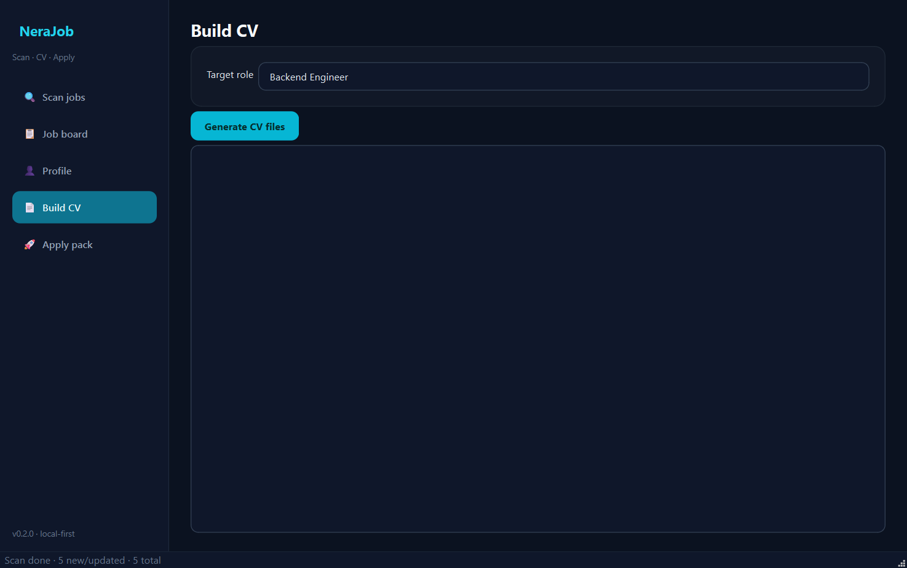
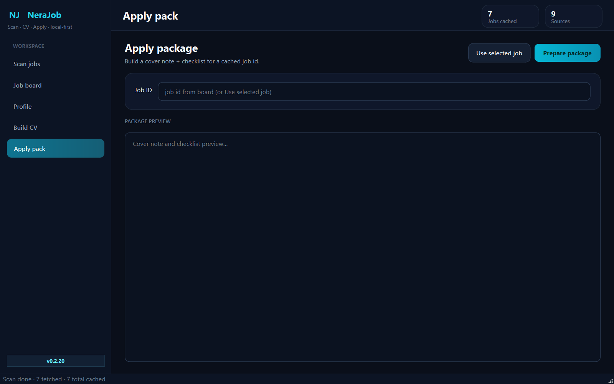
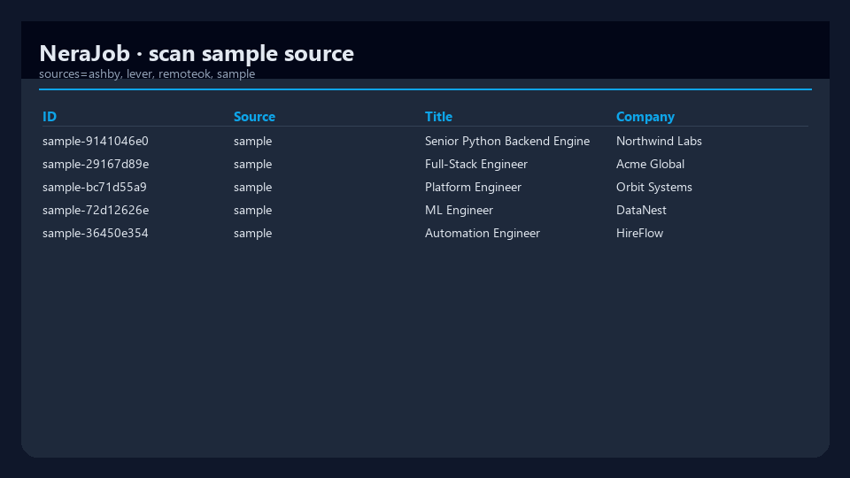
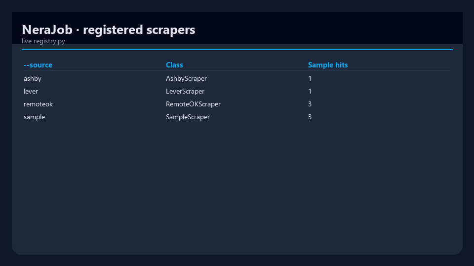
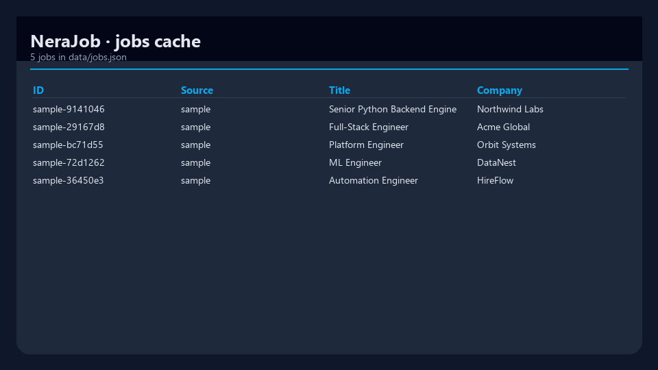

# NeraJob

[](https://www.python.org/downloads/)
[](pyproject.toml)
[](src/nerajob/gui/)
[](LICENSE)
[](https://github.com/mergeos-bounties)

**NeraJob** is a local-first toolkit to **scan job listings**, **build a CV**, and **prepare applications** — with pluggable scrapers and an optional Qt desktop app.

**Product:** [mergeos-bounties/NeraJob](https://github.com/mergeos-bounties/NeraJob)

---

## Table of contents

- [Highlights](#highlights)
- [Desktop GUI (Qt)](#desktop-gui-qt)
- [Screenshots](#screenshots)
- [Supported job sources](#supported-job-sources)
- [Quick start](#quick-start)
- [CLI reference](#cli-reference)
- [Diagrams](#diagrams)
- [Repository layout](#repository-layout)
- [Data layout](#data-layout)
- [Adding a job site](#adding-a-job-site)
- [Skill aliases](#skill-aliases)
- [Compliance](#compliance)
- [Development](#development)
- [MergeOS bounties](#mergeos-bounties)
- [License](#license)

---

## Highlights

| Area | What you get |
| --- | --- |
| **Scan** | Query one source or all scrapers; results cached in `data/jobs.json` |
| **Profile** | Local JSON profile as CV source of truth |
| **CV** | Markdown + plain-text export aimed at a target role |
| **Apply** | Per-job package: cover note, checklist, notes for manual apply |
| **Extensible** | Drop-in scrapers implementing `BaseScraper` + registry |
| **Desktop GUI** | Modern PySide6 app (`nerajob-gui`) |

---

## Desktop GUI (Qt)

Scan jobs, browse the local cache, edit profile, build a CV, and prepare apply packages.

**Layout (v0.2.14+):** sidebar nav · top bar with live stats · page headers with primary actions · scan form as a 2×2 card grid · job board as table + detail split · profile as two-column identity / summary.

```powershell
pip install -e ".[gui]"
nerajob-gui
# or: nerajob gui
```

| Page | What you do |
| --- | --- |
| **Scan** | Keywords, location, source, limit → run one source or all |
| **Job board** | Local cache table + side detail; send row to Apply |
| **Profile** | Name, headline, email, skills, summary → `data/profile.json` |
| **Build CV** | Target role → generate CV files |
| **Apply pack** | Job id → cover note + checklist package |

<p align="center">
  
</p>
<p align="center"><em>Scan — form card + activity log</em></p>

<p align="center">
  
</p>
<p align="center"><em>Job board — table + detail panel</em></p>

<p align="center">
  
</p>
<p align="center"><em>Profile — two-column layout</em></p>

<p align="center">
  
</p>
<p align="center"><em>Build CV</em></p>

<p align="center">
  
</p>
<p align="center"><em>Apply package</em></p>

---

## Screenshots

CLI demo captures:

| Scan | Sources | Jobs cache |
| :---: | :---: | :---: |
|  |  |  |
| *Sample scan* | *Registered scrapers* | *Jobs cache* |

---

## Supported job sources

Full catalog (API links, env vars, bounty issues): **[docs/SOURCES.md](docs/SOURCES.md)**.

### Shipped (available today)

| `--source` | Site | Type | Network | Auth / config |
| --- | --- | --- | --- | --- |
| `sample` | Built-in demo feed | Offline fixtures | No | None |
| `remoteok` | [RemoteOK](https://remoteok.com) | Public JSON API | Yes | Polite User-Agent |
| `lever` | [Lever](https://www.lever.co) public postings | Per-company JSON | Optional | `NERAJOB_LEVER_BOARD` (slug). Without it: offline sample |
| `ashby` | [Ashby](https://www.ashbyhq.com) public board | Per-company JSON | Optional | `NERAJOB_ASHBY_BOARD` (board id). Without it: offline sample |

```powershell
# Offline demo / CI-friendly
nerajob scan --source sample -q python -n 10

# Live remote listings
nerajob scan --source remoteok -q "python backend" -n 20

# Lever / Ashby — set board env for live company boards
$env:NERAJOB_LEVER_BOARD = "netflix"
nerajob scan --source lever -q engineer -n 20

$env:NERAJOB_ASHBY_BOARD = "openai"
nerajob scan --source ashby -q python -n 20

# Every registered scraper
nerajob scan --all -q python -l remote -n 15
```

| Source | Notes |
| --- | --- |
| **sample** | Deterministic roles for demos and tests. No HTTP. |
| **remoteok** | Live adapter for RemoteOK’s public feed. On failure may fall back to `sample`. |
| **lever** | [Postings API](https://github.com/lever/postings-api): `https://api.lever.co/v0/postings/<board>?mode=json` |
| **ashby** | `https://api.ashbyhq.com/posting-api/job-board/<board_id>` |

### Planned (roadmap + open bounties)

Adapters below are **not** in the registry yet. Contribute via open issues labeled `scraper` / `api`.

#### Remote & global public feeds

| Planned | Site | Issue |
| --- | --- | --- |
| `remotive` | [Remotive](https://remotive.com) | [#2](https://github.com/mergeos-bounties/NeraJob/issues/2) |
| `arbeitnow` | [Arbeitnow](https://www.arbeitnow.com) | [#3](https://github.com/mergeos-bounties/NeraJob/issues/3) |
| `jobicy` | [Jobicy](https://jobicy.com) | [#4](https://github.com/mergeos-bounties/NeraJob/issues/4) |
| `himalayas` | [Himalayas](https://himalayas.app) | [#5](https://github.com/mergeos-bounties/NeraJob/issues/5) |
| `findwork` | [Findwork.dev](https://findwork.dev) | [#6](https://github.com/mergeos-bounties/NeraJob/issues/6) |

#### Aggregators & national APIs

| Planned | Site | Issue |
| --- | --- | --- |
| `adzuna` | [Adzuna](https://developer.adzuna.com) | [#7](https://github.com/mergeos-bounties/NeraJob/issues/7) |
| `usajobs` | [USAJOBS](https://developer.usajobs.gov) | [#8](https://github.com/mergeos-bounties/NeraJob/issues/8) |
| `reed` | [Reed.co.uk](https://www.reed.co.uk/developers) | [#9](https://github.com/mergeos-bounties/NeraJob/issues/9) |
| `themuse` | [The Muse](https://www.themuse.com/developers/api/v2) | [#10](https://github.com/mergeos-bounties/NeraJob/issues/10) |
| `jooble` | [Jooble](https://jooble.org/api/about) | [#15](https://github.com/mergeos-bounties/NeraJob/issues/15) |

#### Company career boards (ATS)

| Planned | ATS | Issue |
| --- | --- | --- |
| `greenhouse` | [Greenhouse Job Board API](https://developers.greenhouse.io/job-board.html) | [#11](https://github.com/mergeos-bounties/NeraJob/issues/11) |
| `smartrecruiters` | [SmartRecruiters](https://developers.smartrecruiters.com) | [#14](https://github.com/mergeos-bounties/NeraJob/issues/14) |

> **Lever** and **Ashby** are **shipped**. Remaining ATS boards still planned.

#### Vietnam / regional (ToS-safe only)

| Planned | Notes | Issue |
| --- | --- | --- |
| `topcv` / `vietnamworks` | Prefer official / partner APIs | [#17](https://github.com/mergeos-bounties/NeraJob/issues/17) |

#### Scraper platform work

| Work | Issue |
| --- | --- |
| Shared HTTP client, retries, rate limit, robots-aware policy | [#18](https://github.com/mergeos-bounties/NeraJob/issues/18) |
| `scan --all` aggregation + dedupe | [#19](https://github.com/mergeos-bounties/NeraJob/issues/19) |
| Multi-source pack: 5+ live scrapers with CI mocks | [#22](https://github.com/mergeos-bounties/NeraJob/issues/22) |

---

## Quick start

```powershell
cd NeraJob
python -m venv .venv
.\.venv\Scripts\activate
pip install -e ".[dev,gui]"

nerajob version
nerajob profile init
nerajob scan --source sample -q "python backend" -n 10
nerajob-gui
```

**Stack:** Python 3.11+ · Typer + Rich · httpx · BeautifulSoup4 · Pydantic v2 · local JSON under `data/` · optional PySide6 GUI.

---

## CLI reference

| Command | Purpose |
| --- | --- |
| `nerajob version` | Package version |
| `nerajob profile init` / `show` | Local profile (CV seed) |
| `nerajob scan --source …` | Scan one scraper |
| `nerajob scan --all` | All registered scrapers |
| `nerajob jobs list` | List cached jobs |
| `nerajob jobs match` | Rank cached jobs with configurable match weights |
| `nerajob cv build --target "…"` | Build Markdown + text CV |
| `nerajob apply prepare --job-id <id>` | Apply package for one job |
| `nerajob gui` / `nerajob-gui` | **Qt desktop app** (needs `.[gui]`) |

```powershell
nerajob profile show
nerajob scan --source remoteok -q python -n 20
nerajob cv build --target "Backend Engineer"
nerajob apply prepare --job-id <id>
nerajob jobs list
nerajob jobs match --skill-weight 70 --title-weight 20 --location-weight 12
```

Match scoring defaults to a 70-point skills cap, 20-point title/headline cap, and
12-point location/remote cap. Adjust those weights when a search should favor
role wording or location fit over direct skill hits.

---

## Diagrams

System architecture and workflow — full width. Open the HTML files for **dark/light theme** and export (PNG/SVG).

### Architecture

[Open interactive diagram](docs/diagrams/architecture.html)

<p align="center">
  
</p>

### Workflow

[Open interactive diagram](docs/diagrams/workflow.html)

<p align="center">
  
</p>

*Generated with [archify](https://github.com/tt-a1i).*

---

## Repository layout

```text
src/nerajob/
  cli.py              # Typer CLI entry
  gui/                # PySide6 desktop demo
  config.py           # paths + HTTP settings
  models.py           # Job, Profile, Application models
  storage.py          # JSON persistence under data/
  scrapers/
    base.py           # BaseScraper protocol
    registry.py       # built-in scrapers (keep SOURCES.md in sync)
    sample.py         # offline sample feed
    remoteok.py       # RemoteOK public API
    lever.py          # Lever public postings
    ashby.py          # Ashby public job board
  cv/builder.py
  apply/assistant.py
docs/SOURCES.md
docs/SKILL_ALIASES.md
docs/screenshots/
docs/diagrams/
```

---

## Data layout

```text
data/
  profile.json        # profile / CV source of truth
  jobs.json           # scanned jobs cache
  applications/       # per-job apply packages
```

`data/` is gitignored except for example fixtures. Do not commit real CVs, API keys, or credentials.

---

## Adding a job site

1. Create `src/nerajob/scrapers/mysite.py` implementing `BaseScraper.search(query, location, limit)`
2. Register it in `scrapers/registry.py`
3. Add tests under `tests/` with **mocked HTTP** (CI must not depend on live network)
4. Update **[docs/SOURCES.md](docs/SOURCES.md)** and the tables in this README
5. Prefer official APIs; document rate limits and ToS notes in the PR

See [docs/BOUNTY.md](docs/BOUNTY.md) for MergeOS scraper bounty acceptance.

## Adding a skill domain

Skill aliases live in `src/nerajob/match.py` as `SKILL_ALIASES` — a `dict[str, set[str]]`. Each key is a canonical skill domain, and its set contains matching keywords used for resume ↔ job matching via `expand_skills()`.

### Pattern

Add a new domain entry in `SKILL_ALIASES`:

```python
"new_domain": {"new_domain", "alias1", "alias2", "alias3"},
```

Then add a test in `tests/test_skill_aliases.py`:

```python
def test_expand_skills_new_domain():
    out = expand_skills({"new_domain"})
    assert "alias1" in out
    assert "alias2" in out
```

Verify with the CLI:

```bash
nerajob skills | grep new_domain
pytest tests/test_skill_aliases.py -q
```

### Existing domains (for reference)

Run `nerajob skills` to list all domains and their aliases.

| Domain key | Covers |
| --- | --- |
| `python` | django, fastapi, flask |
| `javascript` | js, typescript, node, react |
| `devops` | docker, kubernetes, k8s, ci/cd |
| `ml_ai` | machine learning, deep learning, nlp, pytorch, tensorflow |
| `data_engineering` | etl, spark, airflow, dbt, warehouse |
| `cybersecurity` | soc, siem, iam, infosec |
| `education` | teaching, curriculum, edtech, tutor |
| *(full list via `nerajob skills`)* | |

Add new domains that don't overlap with existing keys. Each domain set should be self-contained — aliases only expand inward, not across domains.

---

## Skill aliases

NeraJob expands profile skills with `SKILL_ALIASES` in `src/nerajob/match.py`
before scoring jobs. When adding a new skill domain, keep the alias set focused
and add tests that exercise `expand_skills()`.

Contributor guide: **[docs/SKILL_ALIASES.md](docs/SKILL_ALIASES.md)**.

---

## Compliance

NeraJob is built for **ethical, ToS-aware** job discovery:

- Prefer **official / public APIs** over brittle HTML scrapers
- Respect **robots.txt**, published rate limits, and site **Terms of Service**
- **Never** commit secrets, long-lived tokens, or production `.env` values
- Degrade gracefully on network failure (`[]` + optional sample fallback)
- CI uses mocks — live smoke is optional and manual

**Full policy:** [docs/ETHICAL_SCRAPING.md](docs/ETHICAL_SCRAPING.md) — covers principles, preferred official APIs, source-specific ToS notes, rate limit configuration, exponential backoff strategy, User-Agent standard, and a compliance checklist for new scrapers.

Details: [docs/SOURCES.md § Compliance](docs/SOURCES.md#compliance).

---

## Development

```powershell
pytest -q
ruff check src tests
python scripts/capture_gui_shots.py   # refresh GUI screenshots
```

Optional live smoke (network required):

```powershell
nerajob scan --source remoteok -q python -n 5
```

---

## MergeOS bounties

NeraJob issues labeled `bounty` pay **MRG** via MergeOS after merge.

1. Read [docs/BOUNTY.md](docs/BOUNTY.md)
2. Pick an open issue with `reward:*-mrg` (high demand: **scrapers** — see tables above)
3. Star this repo + [mergeos](https://github.com/mergeos-bounties/mergeos); claim on the issue and [Claim Token #1](https://github.com/mergeos-bounties/mergeos/issues/1)
4. Open a PR to this repo (`Fixes #N`)
5. Maintainer merges and credits `github:<you>` on the MergeOS ledger (25 / 50 / 100 / 200)

Docs catalog bounty: [#23](https://github.com/mergeos-bounties/NeraJob/issues/23).  
Roadmap: [docs/ROADMAP.md](docs/ROADMAP.md) · Sources: [docs/SOURCES.md](docs/SOURCES.md)

---

## License

MIT · MergeOS / ThanhTrucSolutions
